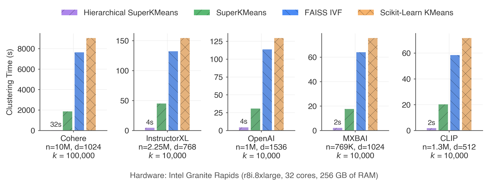
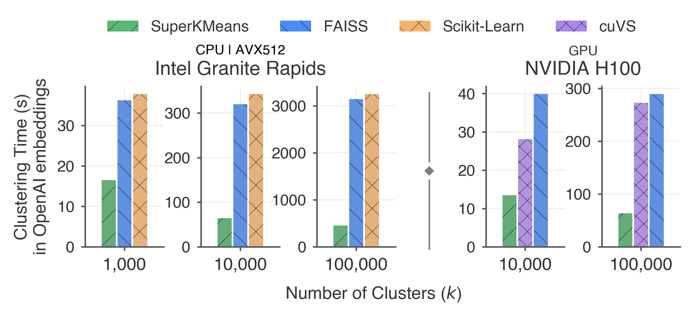

<h1 align="center">
  Super K-Means
<!-- <div align="center"> -->
    <!-- <a href="https://arxiv.org/pdf/2503.04422"></a> -->
    <!-- <a href="https://github.com/cwida/PDX/blob/main/LICENSE"></a>
    <a href="https://github.com/cwida/PDX/stargazers"></a> -->
<!-- </div> -->
</h1>
<h3 align="center">
  The fastest clustering library for high-dimensional vector embeddings
</h3>

<p align="center">
        
</p>

<h4 align="center">
High number of clusters? No problem! SuperKMeans scales like charm
</h4>

<p align="center">
        
</p>

> [!IMPORTANT]
> **VLDB'26 reviewers**: For reproducibility of our results, check [BENCHMARKING.md](./BENCHMARKING.md).
> **For other people**: This library is already usable! But, if you stumble upon this repository, contact lxkr@cwi.nl for more information!

## Why Super K-Means?
- **10x faster clustering** than FAISS of large-scale high-dimensional vector embeddings (Cohere, OpenAI, Contriever, MXBAI, CLIP, MiniLM, GIST).
- Faster **without compromising clustering quality**.
- Efficient in **CPUs** (ARM and x86) and **GPUs**.

## Usage
```py
from superkmeans import SuperKMeans

data = ... # Numpy 2D matrix
k = 1000
d = 768

kmeans = SuperKMeans(
    n_clusters=k,
    dimensionality=d
)

# Run the clustering
centroids = kmeans.train(data) # 2D array with centroids (k x d) 

# Get assignments
assignments = kmeans._assignments

# Or assign new points:
new_data = ...
new_assignments = kmeans.assign(new_data)
```

Then, you can use the `centroids` to create an IVF index for Vector Search, for example, in FAISS.

<details>

<summary>Usage in C++</summary>

```c++
#include <vector>
#include <cstddef>
#include "superkmeans/superkmeans.h"

int main(int argc, char* argv[]) {
    std::vector<float> data;
    size_t k = 1000;
    size_t d = 768;
    auto kmeans = skmeans::SuperKMeans(k, d);
    
    // Run the clustering
    std::vector<float>  centroids = kmeans.Train(data.data(), data.size());
    
    // Get assignments
    auto assignments = kmeans._assignments
    
    // Or assign new points:
    std::vector<float> new_data;
    std::vector<uint32_t> assignments = kmeans.Assign(new_data.data(), new_data.size(), centroids.data(), centroids.size());
}

```

</details>

## Installation
We provide Python bindings for ease of use. 

### Prerequisites
- C++17, CMake 3.26
- OpenMP
- A BLAS implementation
- Python 3 (only for Python bindings)

```sh
git clone https://github.com/lkuffo/SuperKMeans.git
git submodule update --init
pip install . 

# Run plug-and-play example
python ./examples/simple_clustering.py

# Set a value for n, k and d
python ./examples/simple_clustering.py 100000 10000 1536
```

<details>

<summary>Compilation in C++</summary>

```sh
git clone https://github.com/lkuffo/SuperKMeans.git
git submodule update --init

# Compile
cmake .
make simple_clustering.cpp

# Run plug-and-play example
cd examples
./simple_clustering.out

# Set a value for n, k and d
./simple_clustering.out 100000 10000 1536
```
</details>

For a more comprehensive installation and compilation guide, check [INSTALL.md](./INSTALL.md).

## Getting the Best Performance
Check [INSTALL.md](./INSTALL.md).

## Roadmap
We are actively developing Super K-Means and accepting contributions! Check [CONTRIBUTING.md](./CONTRIBUTING.md)

## Benchmarking
To run our benchmark suite in C++, refer to [BENCHMARKING.md](./BENCHMARKING.md).