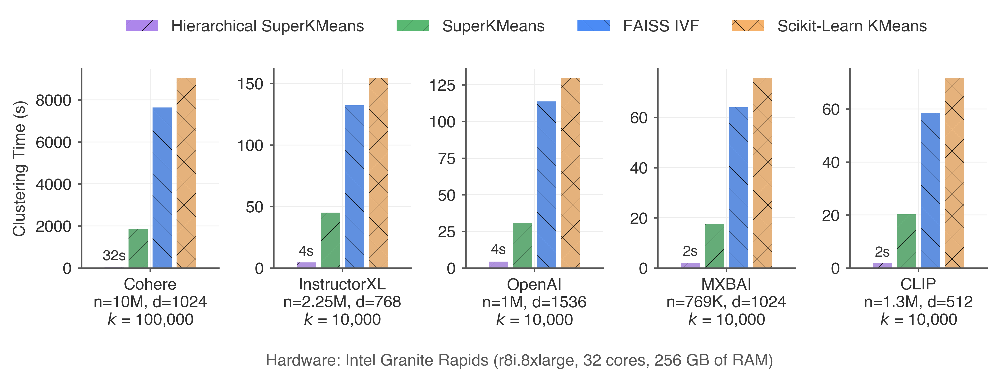

<h1 align="center">
  Super K-Means
<div align="center">
    <a href="https://arxiv.org/pdf/2603.20009"></a>
    <a href="https://arxiv.org/pdf/2608.14648"></a>
    <a href="https://pypi.org/project/superkmeans/"></a>
    
    <a href="https://github.com/cwida/SuperKMeans/blob/main/LICENSE"></a>
    <a href="https://github.com/cwida/SuperKMeans/stargazers"></a>
</div>
</h1>
<h3 align="center">
  A super-fast clustering library for high-dimensional vector embeddings
</h3>

<p align="center">
        
</p>

## Why Super K-Means?
- **Faster clustering** of vector embeddings (Cohere, OpenAI, MXBAI, CLIP, MiniLM) than FAISS.
- Index 10M embeddings of 1024 dimensions [**in less than a minute**](https://www.lkuffo.com/superkmeans/) on a single CPU.
- Faster **without compromising clustering quality**.
- Support for [**quantized clustering**](#quantized-clustering) (8-bit Scalar Quantization, LVQ, and RabitQ)
- Efficient on **CPUs** (ARM and x86) and **GPUs**.

## Our secret sauce
- Carefully interleaving GEMM routines and pruning kernels that **prune dimensions** efficiently
- In the benchmarks you see in the cover image, **all algorithms are clustering the same data**: No dimensionality reduction, no sampling, no early-termination.

## Usage
```py
from superkmeans import SuperKMeans

data = ... # Numpy 2D matrix
k = 1000
d = 768

kmeans = SuperKMeans(
    n_clusters=k,
    dimensionality=d
)

# Run the clustering
centroids = kmeans.train(data) # 2D array with centroids (k x d) 

# Get assignments
assignments = kmeans.assign(data)
```

Then, you can use the `centroids` to create an IVF index for Vector Search, for example, in FAISS.

<details>

<summary>Usage in C++</summary>

```c++
#include <vector>
#include <cstddef>
#include "superkmeans/superkmeans.h"
#include "superkmeans/hierarchical_superkmeans.h"

int main(int argc, char* argv[]) {
    std::vector<float> data; // Fill
    size_t n = 1000000;
    size_t k = 10000;
    size_t d = 768;

    auto kmeans = skmeans::SuperKMeans(k, d);

    // Or Hierarchical Super K-Means for extreme performance:
    // auto kmeans = skmeans::HierarchicalSuperKMeans(k, d);
    
    // Run the clustering
    std::vector<float> centroids = kmeans.Train(data.data(), n);
    
    // Assign points
    std::vector<uint32_t> assignments = kmeans.Assign(data.data(), centroids.data(), n, k);
}

```

</details>

Check our [examples](./examples/) for fully working examples in Python and C++.

## Quantized Clustering
SuperKMeans supports **clustering quantized vectors**, substantially accelerating clustering and barely affecting clustering quality. We support 8-bit scalar quantization, [LVQ](https://arxiv.org/pdf/2304.04759), and [RabitQ](https://github.com/VectorDB-NTU/RaBitQ-Library). You give us `float32` vectors and we handle the rest:

```py
kmeans = SuperKMeans(
    n_clusters=k,
    dimensionality=d,
    quantizer='rabitq' # or: sq8, lvq4
)

centroids = kmeans.train(data) # We return float32 centroids
assignments = kmeans.quantized_assign(data, centroids)
```

> [!TIP]
> **Does quantized clustering hurt the index quality?** Usually, NO: in most embedding datasets, quantized clustering will get you right where full precision will (+ faster indexing). Read [our research paper](https://arxiv.org/pdf/2608.14648) for the full analysis.


Check our fully working examples in [Python](./examples/quantized_clustering.py) or [C++](./examples/quantized_clustering.cpp).

## Documentation
Check [our wiki](https://github.com/cwida/SuperKMeans/wiki/Documentation) for advanced usage and API reference.

## Installation

### Python
```sh
pip install superkmeans
```

> [!TIP]
> For maximum performance, we recommend compiling from source.

### C++
As a header-only library with CMake `FetchContent`:

```cmake
FetchContent_Declare(
    superkmeans
    GIT_REPOSITORY https://github.com/cwida/superkmeans
)
FetchContent_MakeAvailable(superkmeans)

target_link_libraries(myapp PRIVATE superkmeans)
```

<details>

<summary>Compiling Python Bindings from source</summary>

### Prerequisites
- Clang 17 or GCC 13
- CMake 3.26
- OpenMP
- A BLAS implementation
- Python 3 (only for Python bindings)

```bash
git clone https://github.com/cwida/SuperKMeans.git
cd SuperKMeans
git submodule update --init
pip install .

# Run plug-and-play example
python ./examples/simple_clustering.py

# Set a value for n, d and k
python ./examples/simple_clustering.py 200000 1536 1000
```

</details> 

<details>

<summary>Compiling C++ library from source</summary>

### Prerequisites
- Clang 17 or GCC 13
- CMake 3.26
- OpenMP
- A BLAS implementation

```bash
git clone https://github.com/cwida/SuperKMeans.git
cd SuperKMeans
git submodule update --init

# Set proper path to clang if needed
export CXX="/usr/bin/clang++-18" 

# Compile
cmake .
make examples

# Run plug-and-play example
cd examples
./simple_clustering.out

# Set a value for n, d and k
./simple_clustering.out 100000 1536 1000
```
</details> 


For a more comprehensive installation and compilation guide, check [INSTALL.md](./INSTALL.md).

## Getting the Best Performance
Check [INSTALL.md](./INSTALL.md).

## Roadmap
We are actively developing Super K-Means and accepting contributions! Check [CONTRIBUTING.md](./CONTRIBUTING.md).


## Benchmarking
To run our benchmark suite in C++, refer to [BENCHMARKING.md](./BENCHMARKING.md).

## Adoption
SuperKMeans' ideas have been adopted in:
- [FAISS](https://github.com/facebookresearch/faiss/pull/5168)
- [Zilliz](https://github.com/zilliztech/knowhere/pull/1635)
- [Elastic](https://github.com/elastic/elasticsearch/pull/144599)
- [ParadeDB](https://github.com/paradedb/superkmeans-rs)

## Other implementations of SuperKMeans
- [Rust](https://github.com/paradedb/superkmeans-rs)

## Research behind SuperKMeans

**[A Super Fast K-means for Indexing Vector Embeddings](https://arxiv.org/pdf/2603.20009)**   

```bibtex
@article{kuffo2026super,
  title={A Super Fast K-means for Indexing Vector Embeddings},
  author={Kuffo, Leonardo and Hepkema, Sven and Boncz, Peter},
  journal={arXiv preprint arXiv:2603.20009},
  year={2026}
}
```

**[Stop Indexing at Full Precision: Revisiting Clustering for Vector Embeddings](https://arxiv.org/pdf/2608.14648)**   

```bibtex
@article{kuffo2026superquantized,
  title={Stop Indexing at Full Precision: Revisiting Clustering for Vector Embeddings},
  author={Kuffo, Leonardo and Boncz, Peter},
  journal={VLDB 2026 Workshop: The 2nd Workshop on Vector Databases},
  year={2026}
}
```